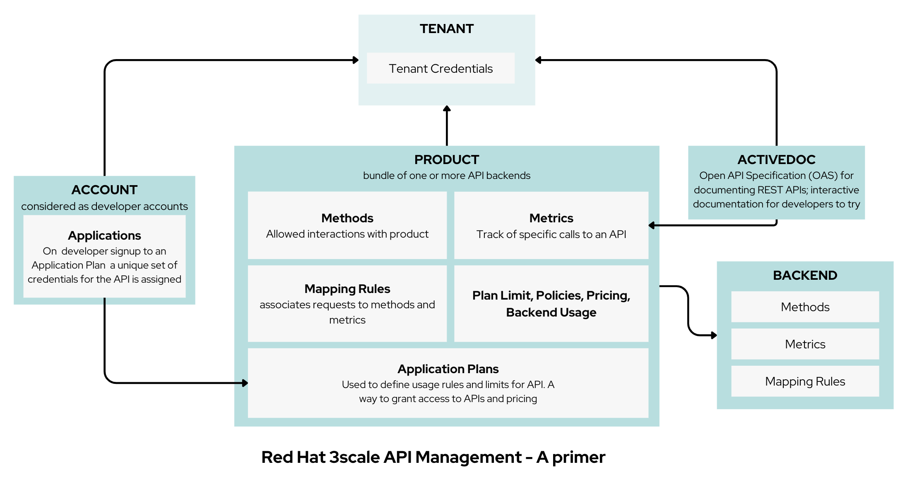
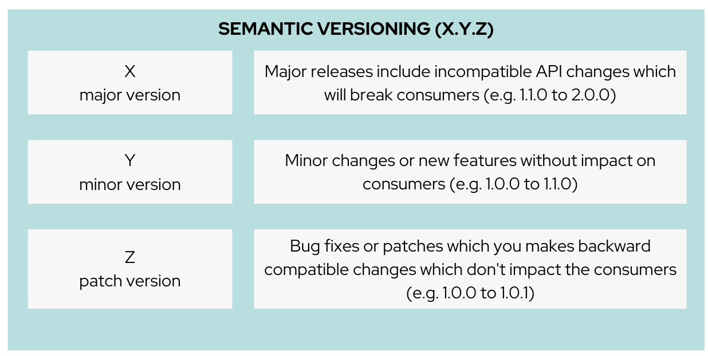

= Solution Pattern: Manage and Secure APIs with an API First Approach
:sectnums:
:sectlinks:
:doctype: book


= Architecture 
== Common Challenges 

Introducing changes in APIs has an impact across different personas. 
 
{set:cellbgcolor:#E7F3F4}
[cols="1a,1a,1a"]
|===

|As an *API Provider*  | As an *API Service Developer*| As an *API Consumer*
|
* Choose the right Versioning Strategy
* Communicate and Notify consumers of the API
* Ensure Backward Compatibility for consumers still using older API versions
* Encourage adoption of new API versions to help with sunsetting of older API versions
* Impact on API management configurations, API gateways, Staging and Production rollout
* Updates to Developer portal, documentation, release notes

|
* Plan for API versioning from the beginning
* Plan for different API versiong running side by side
* Handling of data and database

|
* Reduce tech debt by keeping up with changes to API
* Be alert to notifications from API providers
* Perform Impact assessment (breaking changes/non-breaking changes)
* Roll over to consume new API version
|===

{set:cellbgcolor:!}

[#tech_stack]
== Technology Stack


* https://developers.redhat.com/products/3scale/overview[Red Hat 3scale API Management^]
* https://access.redhat.com/documentation/en-us/red_hat_build_of_apicurio_registry[Red Hat build of Apicurio Registry^]
* https://developers.redhat.com/products/quarkus/overview[Red Hat build of Quarkus^]
* https://studio.apicur.io/[Apicurio API Designer^]
* https://microcks.io/[Microcks^]
* https://quay.io/[Quay^]


[#in_depth]
== An in-depth look at the solution's architecture

This Solution Pattern, as disussed earlier, involves the *OrderPlacement API* which is already in use and needs to undergo changes the following series of changes. 

* *Change 1: A non-breaking change:*
** Introduction of an optional field called `Delivery Instructions` which the customers can use to provide additional info to help with easy delivery
* *Change 2: A breaking change:*
** Moving away from First and Last names as separate fields, to a Full Name field to make it easy for consumers to place orders to represent different cultures and conventions.

=== Setting the stage

Let's look at a quick refresher on 3scale API management and it's various entities

 

// * An API in 3scale is referred to as a Product. Products can have one or many Backends. 
// * A Backend is a web service that 3scale will proxy requests to based on mapping rules defined by the Product. 
// * Application plans can be used to define usage rules and limits for your API. 
// * A developer signs up to an Application Plan of a  API Product; A a unique Application is associated a unique set of credentials for the API, 
// * Method defines the allowed interactions  - such as GET, POST or DELETE - with an API or a product
// * Mapping rules define the metrics or methods that you want to report depending on the requests to your API.
// * Metrics help you track of specific calls to an API

=== When to version 

* Don't change API vesioning lightly. Consumers need a stable versions, and so don't version often
* In fact, frequent versioning is seen as chaotic, disorganised
* Breaking changes should only be considered when there is no other alternative (security/compliance/law) or it becomes uneconomical
* It is good practice to consider a predicatable versioning of APIs (e.g. new versions every 3 months)

=== How to version

* Follow https://semver.org/[Semantic versioning^] (semver) to ensure standardisation +
The extent of changes to an API (or sofware for that matter) drives the versioning by assigning either unique unique version numbers in the form X.Y.Z. 



// (X represent major version, Y minor verson and Z patch version)
//*** Increment X: Major releases include incompatible API changes which will break consumers  (e.g. 1.1.0 to 2.0.0)
//*** Increment Y: Minor changes or new features without impact on consumers (e.g. 1.0.0 to 1.1.0)
//*** Increment Z: Bug fixes or patches which you makes backward compatible changes which don't impact the consumers (e.g. 1.0.0 to 1.0.1) 


[TIP]
====
https://semver.org/ provides fantastic guidance on dos and dont of versioning and is highly recommended read.
====


=== Different API Versioning Strategies
Here are some common types of API versioning: +
Note: These strategies apply when a new API version is applied to the same API Product to handle different versions

* *URL Versioning*: Include the API version as part of the URI
```
Format: 
api.globex.com/v1/OrderPlacement
api.globex.com/v2/OrderPlacement
```
* *Endpoint versioning*: Different endpoint for each API version 
```
Format: 
api.globex.com/orderplacement_v1 
api.globex.com/orderplacement_v2
```
* *Custom header versioning*: Use a header (that is, "x-api-version") to specify the version.
```
Format: 
Header: x-api-version v1 
Header: x-api-version v2
```

[TIP]
====
`URL Versioning` is the most popular API versioning strategy.
====

==== A different approach to API versioning

An alternate way to implement API versioning is to create a completely new API product for a new API version. Sometimes this could be the right way to go. With this approach - especially for breaking changes 

* Consumers can intentionally start adopting a new API and do all the changes testing and rolling out a new version of their software
* API providers can easily understand how many consumers are still using a particular version without having to do a lot of details analytics
* Sunsetting an API product can be easier because there an entire API product can be archived after consumers migrate away to the newer version

==== When to choose what
The answer is, of couse, _it depends_ :)


=== Measure and manage adoption

There will be a point when a API versions or perhaps the API itself will need to be sunset. It is important to plan for this from get-go.  

* Track consumption of API versions to understand usage of APIs and versions. The API management platform should ba able to provide the necessary metrics to do this. 
* Set clear predicatable guidelines on when consumers can expect new API versions. 
** e.g. Patch versions every month; Minor or major versions every 3 monthss. 
** Publish these policies and guidelines on the developer portal so that consumers can manage their development cycles
* Notfy consumers about new API versions being available; and more importanly notify consumers about adopting newer versions, and sunsetting of older versions. You will need to define frequency of how often to notify consumers depending on your business needs, Note that manintaing multiple versions is a burden on providers in having to maintain older versions is reduced and hopfully completely removed. 
* Release notes in the Developer Portal should clearly articulate changes in each version, along with examples and a way to try out.


[#more_tech]
== More about the Technology Stack

=== API Design, Govern and Mockup

* As part of the API-First approach, the first step, of course, is to design the APIs. API Designer is a tool to design your APIs used by various stakeholders  to define the API specs. The API are defined for the existing catalogue service as well. 
* Once the API design is complete, the API versions can now published  in a schema registry. https://access.redhat.com/documentation/en-us/red_hat_build_of_apicurio_registry[Red Hat build of Apicurio Registry^, window=_blank] is a datastore for sharing standard event schemas and API designs across event-driven and API architectures. 
** You can upload new artifacts, new versions,  view the metadata, download the specs, view documentation and view the content as well.
** Through Content rules one can validate new versions of the APIs against the existing specs to ensure validity and backward compatibility.
* Microcks can be used to mock the APIs so that the various development teams can to develop their pieces of code even before the APIs are completely implemented

These stages have been already discussed in the https://redhat-solution-patterns.github.io/solution-pattern-api-first[Manage and Secure APIs with an API First Approach^]. Please refer to this pattern to learn more about these stages.


[#3scale]
=== Red Hat 3scale API Management
We use the managed *Red Hat 3scale API Management* platform here to publish, manage and secure the backend APIs.

Each API can be configured to be secured using a number of ways. In this case, the APIs  are secured with an API key which should be passed through http request header. 3scale allows you to have various application plans. Developers can subscribe to those APIs and can access APIs through an assigned API key  securely.  You can monitor the APIs and also track usage

As a developer, you would like to build functionality around the APIs. There is also a Development Portal  which is currently under, well, development. You can sign in as a developer here.  This developer  has already subscribed to the API and is given an API key which should be used in all API calls to ensure the calls are authenticated by the API management platform.

The devportal allows viewing Live documentation as well, which is another view of the OpenAPI specs. Developers can try it out  to see what kind of responses they can get back. The developers can also view statistics for their account  in a graph format

[#source-code]
=== GitOps and ArgoCD

<TBC>